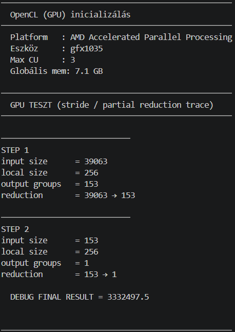

# Feladat: Vektorok négyzetösszege (sum of squares)

## Leírás

- Legyen egy nagyméretű tömb (`N = 10_000_000`) lebegőpontos számokkal.
- Számítsa ki minden elem négyzetét, majd összegezze az eredményt (**sum of squares**).
- A számítás történjen **OpenCL kernelben**, majd **összehasonlításképp CPU-n NumPy-vel**.
- Mérje az időt mindkét módszerrel a gyorsítás láthatóságához.
- A mérési eredményekből **grafikonok készülnek**, amelyek összehasonlítják a GPU és CPU teljesítményét.

## Tesztelhető kritériumok

- `N` véletlenszerű szám (`float32`), például:
  ```python
  np.random.rand(N).astype(np.float32)
  ```

---

## Fájlok

| Fájl                | Leírás                                              |
| ------------------- | --------------------------------------------------- |
| `sum_of_squares.cl` | OpenCL kernel – elem-szintű négyzetre emelés GPU-n  |
| `main.py`           | Fő benchmark szkript – CPU + GPU mérés, JSON export |
| `results.py`        | Grafikon szkript – 6 panel, dark theme              |
| `results.json`      | Automatikusan generálódik `main.py` futtatásakor    |
| `plots.png`         | Automatikusan generálódik `results.py` futtatásakor |

---

## Telepítés és futtatás

### Függőségek

```powershell
py -m pip install pyopencl numpy matplotlib
```

### Futtatás

```powershell
# 1. Benchmark – méri a CPU és GPU időt, elmenti az eredményeket
py main.py

# 2. Grafikonok generálása az eredményekből
py results.py
```

> A `main.py`-t mindig előbb kell futtatni, mert létrehozza a `results.json` fájlt, amelyet a `results.py` olvas be.

---

## Mit mér a program?

| Mérőszám                  | Leírás                                               |
| ------------------------- | ---------------------------------------------------- |
| **CPU idő**               | NumPy `np.sum(x**2)` végrehajtási ideje              |
| **GPU kernel idő**        | Csak az OpenCL kernel futási ideje (event profiling) |
| **GPU pipeline idő**      | Kernel + host↔device memóriaátvitel együtt           |
| **Gyorsítás (×)**         | CPU idő / GPU idő – mindkét GPU mérőszámra           |
| **Numerikus pontosság**   | CPU és GPU eredmény relatív eltérése                 |
| **Effektív sávszélesség** | `2 × N × 4 byte / kernel_idő` (GB/s)                 |

---

## Grafikonok (`results.py`)

1. **Futási idők** – lineáris bar chart (ms)
2. **Gyorsítás** – CPU / GPU arány (×)
3. **Numerikus eredmény** – CPU vs GPU négyzetösszeg értéke
4. **Log-skálás idők** – kis különbségek is láthatók
5. **GPU pipeline bontás** – kernel vs. memóriaátvitel (stacked bar)
6. **Memória-sávszélesség** – effektív GB/s becslés

---

## OpenCL kernel (`sum_of_squares.cl`)

```c
__kernel void sum_of_squares(__global const float* input,
                              __global float* output,
                              const int n)
{
    __local float scratch[256];
    int gid = get_global_id(0);
    int lid = get_local_id(0);
    int local_size = get_local_size(0);

    scratch[lid] = (gid < n) ? (input[gid] * input[gid]) : 0.0f;
    barrier(CLK_LOCAL_MEM_FENCE);

    for (int stride = local_size / 2; stride > 0; stride >>= 1) {
        if (lid < stride) scratch[lid] += scratch[lid + stride];
        barrier(CLK_LOCAL_MEM_FENCE);
    }

    if (lid == 0) output[get_group_id(0)] = scratch[0];
}
__kernel void reduce(__global const float* input,
                     __global float* output,
                     const int n)
{
    __local float scratch[256];
    int gid = get_global_id(0);
    int lid = get_local_id(0);
    int local_size = get_local_size(0);

    scratch[lid] = (gid < n) ? input[gid] : 0.0f;
    barrier(CLK_LOCAL_MEM_FENCE);

    for (int stride = local_size / 2; stride > 0; stride >>= 1) {
        if (lid < stride) scratch[lid] += scratch[lid + stride];
        barrier(CLK_LOCAL_MEM_FENCE);
    }

    if (lid == 0) output[get_group_id(0)] = scratch[0];
}
```

Minden work-item a saját indexén (`gid`) dolgozik: beolvassa az adott elemet, négyzetre emeli, és kiírja az output tömbbe. Az összegzés ezután CPU-n történik (`np.sum`).

## Összegzés

A GPU-s számítás **hierarchikus (tree) reduction** módszert használ.

### Folyamat:

1. **Elem-szintű feldolgozás**
   - minden work-item kiszámolja:
     \[
     x_i^2
     \]

2. **Work-group szintű összeadás**
   - lokális memória (`__local`) használatával
   - stride-alapú bináris összeadás

3. **Többlépcsős redukció**
   - a partial eredmények újra GPU kernelbe kerülnek
   - addig ismétlődik, amíg 1 érték marad

### Reduction lánc:

10,000,000 → 39,063 → 153 → 1

Ez O(log N) mélységű hierarchiát jelent.

---

## OpenCL implementáció

- `sum_of_squares`: inicializálás + első reduction pass
- `reduce`: további hierarchikus összeadás

Lokális memória használata:

- 256 elem/work-group
- barrier szinkronizációval

---

## Mérési eredmények



### Futási idők

| Módszer             | Idő      |
| ------------------- | -------- |
| CPU (NumPy)         | 25.55 ms |
| GPU kernel          | 2.37 ms  |
| GPU teljes pipeline | 3.92 ms  |

---

### Gyorsítás

| Metrika         | Gyorsítás |
| --------------- | --------- |
| Kernel-only     | **10.8×** |
| Teljes pipeline | **6.5×**  |

---

### Numerikus pontosság

- CPU eredmény: `3332497.25`
- GPU eredmény: `3332497.5`

Relatív eltérés:

7.5 × 10⁻⁸ → ✓ helyes egyezés

---

## Pipeline bontás

- Kernel execution: ~2.37 ms
- Host + memory overhead: ~1.5 ms

a teljes futás nem csak compute, hanem memória és launch overhead is.

---

## Összegzés

Ez a projekt bemutatja:

- GPU párhuzamos számítás (OpenCL)
- tree reduction algoritmus működése
- lokális memória használata (work-group optimalizáció)
- CPU vs GPU teljesítménykülönbség
- multi-pass GPU pipeline viselkedés

---

## Fő tanulság

- A GPU compute része rendkívül gyors (~10× CPU gyorsítás)
- A teljes gyorsítás kisebb (~6.5×), mert:
  - kernel indítási overhead
  - memória mozgatás
  - többlépcsős reduction pipeline
